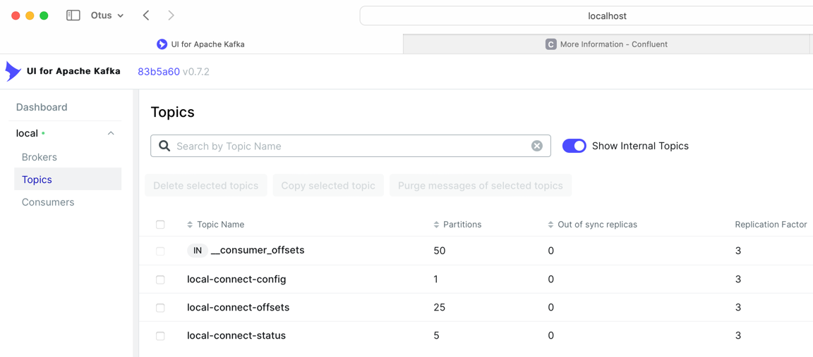
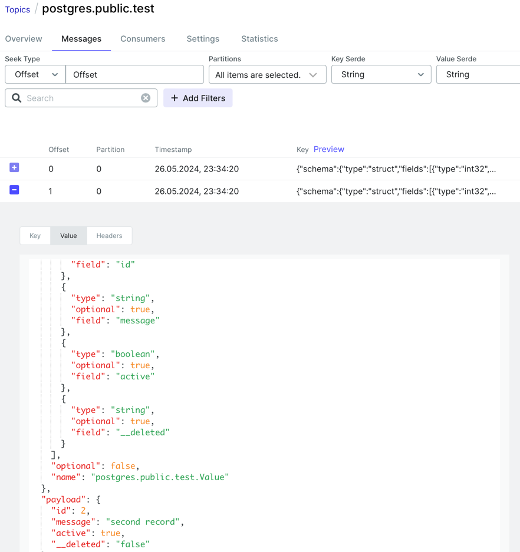
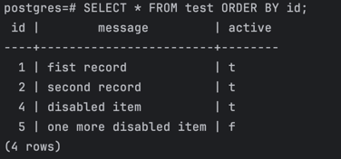

# Postgres, Debezium с использованием Docker

1. Запустить контейнеры Zookeeper, Postgres, Kafka, Kafka Connect, kafka-ui
```bash
docker compose up -d
docker compose ps -a
```
 

2. Проверить логи Kafka Connect
```bash
docker logs -f connect
```


3. Проверить статус
```bash
curl http://localhost:8083 | jq
```


4. Запросить список плагинов коннекторов 
```bash
curl http://localhost:8083/connector-plugins | jq
```


5. Проверить список топиков \


6. Создать таблицу в postgres и заполнить ее данными
```bash
    docker exec -ti postgres psql -U postgres
```
```sql
CREATE TABLE test (id INT PRIMARY KEY, message TEXT, active BOOLEAN);
INSERT INTO test (id, message, active) VALUES (1, 'fist record', TRUE);
INSERT INTO test (id, message, active) VALUES (2, 'second record', TRUE);
INSERT INTO test (id, message, active) VALUES (3, 'one more row', TRUE);
INSERT INTO test (id, message, active) VALUES (4, 'disabled item', FALSE);
```
 \


7. Создать коннектор
```bash
curl -X POST --data-binary "@test_data.json" -H "Content-Type: application/json" http://localhost:8083/connectors | jq
```


8. Проверить статус коннектора
```bash
curl http://localhost:8083/connectors/test-data-connector/status | jq
```


10. Проверить топики \


12. Прочитать данные в топике \
 \
 

13. Открыть postgres, добавить 1 новую запись, модифицировать 1 старую запись и удалить 1 запись
```bash
    docker exec -ti postgres psql -U postgres
```
```sql
    INSERT INTO test (id, message, active) VALUES (5, 'one more disabled item', FALSE);
    UPDATE test SET active = TRUE WHERE id = 4;
    DELETE FROM test WHERE id = 3;
```
 \
 \

14. Посмотреть содержимое топика \
 \
 \
 \
 \
 

15. Удалить коннектор
```bash
curl -X DELETE http://localhost:8083/connectors/test-data-connector
```


16. Остановить контейнеры и выполнить очистку
```bash
docker compose stop
```
```bash
docker container prune -f
```
```bash
docker volume prune -f
```